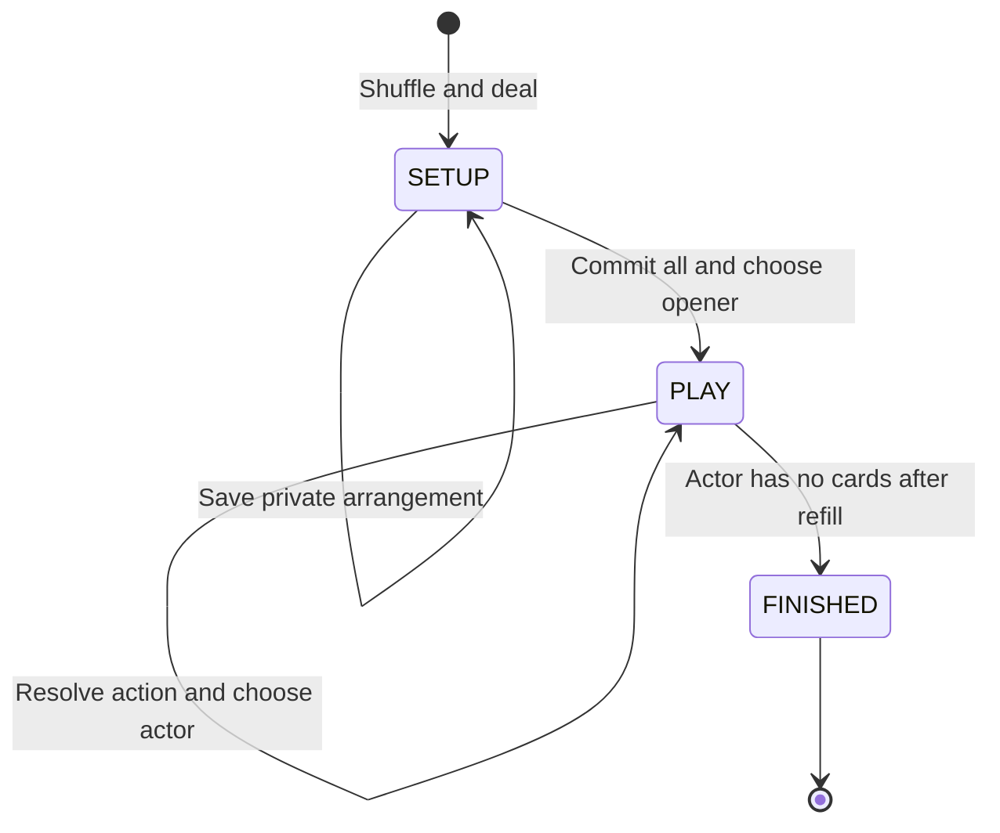
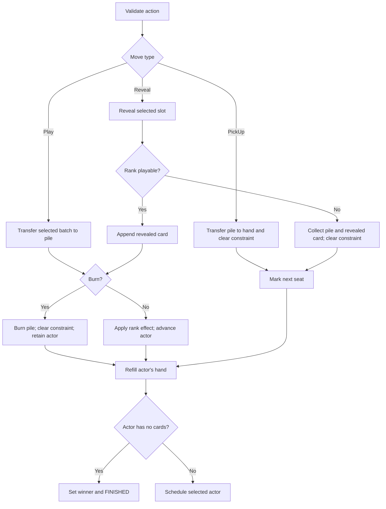

# Shed: implementation specification

Status: implementation-ready design, not an implemented or benchmarked codebase.  
Specification date: 2026-09-08.  
Rules profile: `shed-v1`. Replay schema: `1`.

## 1. Purpose and scope

Build a small Python project for **Shed**, a hidden-information card game. It must support an authoritative engine, interchangeable agents, timed decisions with repeated move submissions, complete match replays, and a gauntlet that compares agents on shared deals and rotated seats.

This document consolidates the conversation into one consistent implementation contract. Where earlier sketches differed, this document selects a default explicitly. Use `shed` in package names, commands, documentation, and result files. The original Dutch game name appears only in source links.

The architectural inspiration is the [Hive repository](https://github.com/maxvandenhoven/hive), especially its engine and agents packages. The earlier discussion described an inspected revision `93204fd`; that inspection is supplied conversation context, not a fresh repository audit for this document. Reuse its separation of state, rules, and strategies. Do not depend on Hive, copy its two-player assumptions, or build a framework supporting both games.

### Required first release

- One installable Python package, with `engine` and `agents` subpackages.
- A fixed, documented rules profile for 2–5 players.
- Deterministic deal creation, legal moves, observations, apply/undo, and outcomes.
- Random and greedy agents using the same interface.
- A match runner enforcing a wall-time budget per decision.
- Unlimited candidate submissions within that budget, optional early finalization, and legal fallback selection.
- A sequential gauntlet, JSON replay/results, command-line scripts, tests, and benchmarks.
- `uv`, `ruff`, `ty`, and `pytest` for development.

### Deferred extensions

Monte Carlo search, belief sampling, persistent workers, parallel gauntlets, configurable rule families, a GUI, networking, and hostile-code sandboxing are future work. Define extension interfaces where described, but do not implement empty plugin systems or speculative class hierarchies.

## 2. Architecture at a glance

| Piece | Owns | Main consumer |
| --- | --- | --- |
| `GameState` | All physical cards, hidden assignments, deck order, phase, actor | `Ruleset` and trusted simulations |
| `PlayerView` | Immutable information available to one player | Agents |
| `Move` | One decision: arrange, play, reveal, or pick up | Ruleset and runner |
| `Ruleset` | Initialization, observation, legality, resolution, undo, outcome | Runner, agents' hypothetical simulations |
| `Agent` | Strategy; submits candidate decisions | Runner's worker process |
| `TurnContext` | Agent-facing submission channel and remaining-time query | Agent |
| `MatchRunner` | Timing, worker lifecycle, selection, fallbacks, history, replay | Scripts and gauntlet |
| Gauntlet | Match schedules, independent seeds, seat rotations, statistics | Evaluation scripts |

Flow: gauntlet schedules a match → runner builds a player view → agent submits candidates → runner selects one → engine resolves it → repeat → gauntlet records results.

Dependencies point inward: engine depends only on the standard library; agents depend on engine types; match runner depends on both; gauntlet depends on match runner. Engine code never imports agents, timing, scripts, or multiprocessing.

## 3. Rules and selected interpretation

### 3.1 Source and provenance

The source variant describes 2–5 players aiming to shed all cards first. Each starts with three cards in hand and three each face-up and face-down, with initial hand/table swaps. Players use equal-or-higher ranks, may play matching-rank batches, replenish their hands, and pick up when blocked. Special cards include always-playable twos, transparent nines, jokers, sevens imposing a lower-rank restriction, and tens clearing the pile. Playing four equal cards together also clears it. See the [original rules article](https://favorietespel.nl/zweeds-pesten-regels/).

The remaining rules below are **the project's normative implementation contract**, consolidating the supplied conversation and resolving ambiguities. They are not a claim that every detail is specified by the article. Version the profile whenever observable game semantics change.

### 3.2 Deck and setup

1. Use 52 ordinary cards and two distinct jokers: 54 uniquely identified physical cards.
2. Ordinary ranks are 2 through ace, with ace high. Suits do not affect strategy or legality.
3. Use ordered seats `0..player_count-1`. Default dealer is seat `0`; support an explicit valid dealer argument.
4. Build the unshuffled deck deterministically: suits clubs, diamonds, hearts, spades; ranks ascending 2..ace within each suit; then two jokers. Assign IDs `0..53` before shuffling.
5. Shuffle once with a dedicated `random.Random(seed)`. The end of the deck list is the next card to draw.
6. Deal clockwise beginning after the dealer: three rounds to face-down slots `0,1,2`, then three rounds face-up, then three rounds to hands. Each round gives one card to each seat.
7. Keep all remaining cards as the draw pile. Start with an empty discard pile, empty burned collection, and unrestricted constraint.
8. Every player privately chooses exactly three physical cards from their six hand/face-up cards to become their final face-up cards. The remaining three become their hand. Keeping the original arrangement is legal.
9. Request arrangements in clockwise order after the dealer. Store submissions privately without applying them. Commit all arrangements together only after everyone has chosen.
10. Select the opening player from post-arrangement hands. Search ranks in this order: 3,4,5,6,7,8,9,10,J,Q,K,A,2,joker. For the first rank present, break player ties clockwise after the dealer.
11. Do not force a particular opening card; the opening pile is unrestricted.

Face-down card identities are unknown even to their owner. Face-down slot IDs remain stable when other slots are removed. Face-up cards are a collection: they do not block the specific face-down slot underneath them.

### 3.3 Active zone and decisions

| Condition, checked in order | Available decision source |
| --- | --- |
| Hand nonempty | Hand |
| Hand empty but draw pile nonempty | Engine must refill before requesting a decision |
| Hand and deck empty, face-up cards remain | Face-up collection |
| Hand, deck, and face-up collection empty | Any remaining face-down slot |
| All personal zones empty | Player has finished; no new decision |

For hand or face-up play, choose a rank and a count from one active zone. A batch must contain only that rank. The engine chooses the physical cards by ascending card ID. Never combine hand and table cards in one move.

If no playable hand/face-up batch exists, `PickUp()` is the only legal action. Voluntary pickup is not allowed in `shed-v1`. Pickup transfers the whole discard pile to the actor's hand, clears the constraint, and passes play to the next seat. An empty pile is unrestricted, so an ordinary live card decision cannot legitimately be blocked on an empty pile.

For face-down play, every remaining slot is legal to select. Reveal one card, then test its rank against the pre-reveal constraint. On success resolve it as a single-card play. On failure collect both that card and the old discard pile into the actor's hand, clear the constraint, and advance. A failed final reveal does not win.

### 3.4 Rank legality and effects

| Rank/action | Legality | Successful effect when no burn occurs |
| --- | --- | --- |
| Ordinary rank, including seven | Must satisfy current constraint | Normally `AtLeast(rank)`; seven sets `AtMost(SEVEN)` |
| Two | Always legal | `AtLeast(TWO)` |
| Nine | Always legal | Preserve previous constraint exactly |
| Ten | Always legal in this profile | Burn entire pile, including played cards |
| Joker | Always legal | Reset to `Unrestricted()` |
| Four-card batch of one rank | Must first satisfy that rank's legality | Burn entire pile, including played cards |

`Unrestricted` accepts any ordinary rank. `AtLeast(r)` accepts ranks greater than or equal to `r`. `AtMost(r)` accepts ranks less than or equal to `r`. Apply the always-playable exceptions before ordinary comparisons; a joker's enum value must never determine its game strength.

The seven restriction is represented by the current constraint, not a countdown of players. A nine preserves it. An ordinary successful play replaces it. Examples: 7 → 9 still requires at most 7; 7 → 5 leaves at least 5; 7 → 2 leaves at least 2.

Only a batch of four played in a **single action** triggers the four-card burn. Do not burn because four equal ranks have accumulated across separate actions. A ten's burn takes precedence when selecting the recorded burn reason.

### 3.5 Resolution, replenishment, and termination

After successful play, resolve burn or constraint changes, then replenish the actor's hand to three while the deck has cards. Drawing is automatic and is not an agent decision. Pickup and failed reveal also finish with the same refill helper; it never removes cards when a hand already has at least three.

A burn moves the entire discard pile to burned cards, clears the constraint, and grants the same actor a new decision with a fresh time budget. Otherwise advance one seat clockwise.

Check whether the actor has zero cards across all personal zones **after replenishment**, before scheduling another actor. The first such player wins and the game ends immediately. A successful final burn wins rather than granting an extra turn. There are no eliminations, last-player-loses rules, passes, jokers skipping players, or chained off-turn responses in this profile.

For evaluating potentially cyclic play, the runner imposes an action limit; reaching it is a truncation, not a rules-level draw or win.

## 4. Simple repository structure

Use a normal `src` layout with one namespace package root, `shed`. Avoid separate distributions or a monorepo. The table is the intended file layout; add a file only when it has actual responsibilities.

| Path | Responsibility |
| --- | --- |
| `pyproject.toml` | Packaging, dependencies, Ruff, ty, pytest configuration |
| `uv.lock` | Committed dependency lockfile |
| `.python-version` | Python 3.12 baseline |
| `.gitignore` | Virtualenvs, caches, generated results, build output |
| `README.md` | Install, play, evaluate, and development commands |
| `docs/implementation.md` | This specification |
| `src/shed/__init__.py` | Package metadata; minimal exports |
| `src/shed/engine/__init__.py` | Intentional public engine exports |
| `src/shed/engine/types.py` | IDs, cards, enums, constraints, moves, fixed rules config |
| `src/shed/engine/state.py` | Mutable state, immutable observations, derived active zone |
| `src/shed/engine/rules.py` | Shared legality functions and `Ruleset` orchestration |
| `src/shed/engine/events.py` | Event and transition/undo types |
| `src/shed/agents/__init__.py` | Public agent exports |
| `src/shed/agents/base.py` | Agent ABC, turn protocol, serializable `AgentSpec`, built-in factory |
| `src/shed/agents/random.py` | Random baseline |
| `src/shed/agents/greedy.py` | Deterministic shedding heuristic with seeded tie-breaking |
| `src/shed/match.py` | Match runner, process worker, pipe context, turn-selection helper |
| `src/shed/gauntlet.py` | Schedules and aggregation |
| `src/shed/replay.py` | Versioned JSON serialization and replay validation |
| `scripts/play.py` | Run one match |
| `scripts/gauntlet.py` | Run a sequential evaluation |
| `scripts/replay.py` | Verify or summarize a saved replay |
| `scripts/benchmark.py` | Engine-only benchmark fixtures and measurements |
| `tests/engine/` | Rules, views, invariants, undo, setup tests |
| `tests/agents/` | Baseline behavior and interface tests |
| `tests/test_match.py` | Submission, timing, worker lifecycle, fallback tests |
| `tests/test_gauntlet.py` | Schedules, seeds, accounting |
| `tests/test_replay.py` | Serialization and replay round trips |
| `tests/conftest.py` | Small deterministic fixtures |
| `results/` | Generated local outputs, ignored by Git |

Imports use `from shed.engine import ...`, never `from src...`. Scripts are thin argument parsers; reusable logic lives under `src/shed`. Keep multiprocessing entry points at module scope and script startup behind `if __name__ == "__main__":`.

## 5. Supporting types

The definitions below describe the required public shape. Split them into the modules above, add imports, and implement the specified methods. They are not a single file to copy verbatim.

```python
from dataclasses import dataclass, field
from enum import Enum, IntEnum
from typing import NewType

PlayerId = NewType("PlayerId", int)
CardId = NewType("CardId", int)
SlotId = NewType("SlotId", int)


class Suit(Enum):
    CLUBS = "clubs"
    DIAMONDS = "diamonds"
    HEARTS = "hearts"
    SPADES = "spades"


class Rank(IntEnum):
    TWO = 2
    THREE = 3
    FOUR = 4
    FIVE = 5
    SIX = 6
    SEVEN = 7
    EIGHT = 8
    NINE = 9
    TEN = 10
    JACK = 11
    QUEEN = 12
    KING = 13
    ACE = 14
    JOKER = 15  # Identity only; always handled specially.


class Zone(Enum):
    HAND = "hand"
    FACE_UP = "face_up"
    FACE_DOWN = "face_down"


class Phase(Enum):
    SETUP = "setup"
    PLAY = "play"
    FINISHED = "finished"


@dataclass(frozen=True, slots=True)
class Card:
    id: CardId
    rank: Rank
    suit: Suit | None


@dataclass(frozen=True, slots=True)
class Unrestricted:
    pass


@dataclass(frozen=True, slots=True)
class AtLeast:
    rank: Rank


@dataclass(frozen=True, slots=True)
class AtMost:
    rank: Rank


type PlayConstraint = Unrestricted | AtLeast | AtMost


@dataclass(frozen=True, slots=True)
class Arrange:
    face_up_cards: tuple[CardId, CardId, CardId]


@dataclass(frozen=True, slots=True)
class Play:
    source: Zone
    rank: Rank
    count: int


@dataclass(frozen=True, slots=True)
class Reveal:
    slot: SlotId


@dataclass(frozen=True, slots=True)
class PickUp:
    pass


type Move = Arrange | Play | Reveal | PickUp


@dataclass(frozen=True, slots=True)
class RulesConfig:
    id: str = "shed-v1"
    min_players: int = 2
    max_players: int = 5
    joker_count: int = 2
    initial_hand_size: int = 3
    initial_face_up_count: int = 3
    initial_face_down_count: int = 3
    refill_target: int = 3
```

Validate card/joker suit consistency: jokers have no suit, ordinary cards have a suit. `Play` accepts only hand or face-up sources and positive counts. `Arrange` requires three distinct non-negative IDs and normalizes their order ascending. Legality then checks ownership and availability.

**Strict domain types.** Engine constructors take correctly typed domain objects and assume their annotations hold: `Play` takes a `Rank`, never an integer it converts into one. `__post_init__` checks domain invariants only — non-negative identifiers and slots, positive play counts, playable sources, distinct arrangement IDs, joker/suit consistency, supported profiles — and never coerces or runtime-type-checks its inputs. `ty` enforces the annotations for engine callers, and a decoding failure is a decoder bug rather than something every constructor re-checks.

Serialization and deserialization belong entirely outside the engine, in the replay and transport layers. Those layers validate untyped external data — decoded JSON, agent messages — where it enters the process and construct domain objects before calling the engine; the engine itself stays free of JSON, transport, and replay decoding. This deliberately supersedes the earlier requirement that constructors coerce decoded representations and reject booleans masquerading as integers: those checks are the decoder's, and their tests belong to the decoder.

All moves and cards are immutable and hashable. Canonicalization ensures equivalent arrangements compare equal; rank/count moves already eliminate suit permutations. Face-up public cards and hand tuples are sorted by card ID for stable representation; discard/draw order is meaningful and must be preserved.

`RulesConfig` documents the fixed profile; first release must reject changed field values or unknown IDs rather than silently claiming they are `shed-v1`. Validation covers correctly typed configurations, and every public entry point that consumes a profile — deck construction included — calls it, so a supported-looking but changed profile can never quietly produce a non-standard deck or game. Earlier optional flags for tens, jokers, pickup, and burns are deliberately replaced by fixed semantics. Add profiles only alongside explicit rules and tests.

## 6. Authoritative state and observations

```python
@dataclass(slots=True)
class PlayerState:
    hand: list[Card] = field(default_factory=list)
    face_up: list[Card] = field(default_factory=list)
    face_down: dict[SlotId, Card] = field(default_factory=dict)

    @property
    def remaining_count(self) -> int: ...

    def active_zone(self, draw_count: int) -> Zone | None: ...


@dataclass(slots=True)
class SetupState:
    pending: list[PlayerId]
    submissions: dict[PlayerId, Arrange] = field(default_factory=dict)


@dataclass(frozen=True, slots=True)
class Outcome:
    winner: PlayerId


@dataclass(slots=True)
class GameState:
    rules: RulesConfig
    players: dict[PlayerId, PlayerState]
    seat_order: tuple[PlayerId, ...]
    dealer: PlayerId
    phase: Phase
    current_player: PlayerId | None
    current_ply: int
    draw_pile: list[Card]
    discard_pile: list[Card]
    burned_cards: list[Card]
    constraint: PlayConstraint
    setup: SetupState | None
    outcome: Outcome | None

    def get_legal_moves(self) -> tuple[Move, ...]: ...


@dataclass(frozen=True, slots=True)
class PublicPlayerState:
    player: PlayerId
    hand_count: int
    face_up: tuple[Card, ...]
    face_down_slots: tuple[SlotId, ...]


@dataclass(frozen=True, slots=True)
class PlayerView:
    rules: RulesConfig
    viewer: PlayerId
    seat_order: tuple[PlayerId, ...]
    dealer: PlayerId
    phase: Phase
    current_player: PlayerId | None
    current_ply: int
    hand: tuple[Card, ...]
    players: tuple[PublicPlayerState, ...]
    draw_count: int
    discard_pile: tuple[Card, ...]
    burned_cards: tuple[Card, ...]
    constraint: PlayConstraint
    outcome: Outcome | None
    history: tuple[ObservedEvent, ...]

    @property
    def me(self) -> PublicPlayerState: ...

    def get_legal_moves(self) -> tuple[Move, ...]: ...
```

`current_ply` counts only resolved PLAY decisions, including pickup and failed reveal. It increments exactly once per such decision. Setup decisions do not increment it. The runner separately numbers **all** decisions, including setup and extra turns.

`current_player` is the next arrangement submitter in SETUP, the current actor in PLAY, and `None` in FINISHED. `setup` exists only in SETUP. Do not store an independently mutable active-zone field.

### Information boundary

`PlayerView` contains no mutable references into `GameState`: nested exposed collections are tuples and their elements are frozen. Do not expose opponents' hidden cards, any face-down identities, shuffle seeds, complete replays, RNG state, deck order, or setup submission contents.

An observation contains public cards and the viewer's current hand. History preserves previously known information even after a card changes zones. Agent policy must depend only on the view, public rules, its configuration, and its independent random seed.

`observe()` is read-only. It must not resolve a refill or mutate the game. Invalid decision-boundary states raise an invariant error; automatic work belongs inside initialization or `apply_move()`.

### History and events

Store growing history in the runner, outside `GameState`. Use these frozen event types:

| Event | Fields and visibility |
| --- | --- |
| `GameStarted` | Dealer, seats, initial public player states; public |
| `HandDealt` | Player, count, cards; card identities visible only to recipient |
| `ArrangementCommitted` | Player and final face-up cards; public, emitted only at collective commit |
| `CardsPlayed` | Player, source, selected physical cards; public |
| `CardRevealed` | Player, slot, card, playable flag; public |
| `CardsDrawn` | Player, count, cards; identities visible only to drawing player |
| `PilePickedUp` | Player and transferred cards, including failed reveal when applicable; public |
| `PileBurned` | Player, cards, reason `TEN` or `FOUR_OF_A_KIND`; public |
| `GameEnded` | Outcome; public |

`ObservedEvent` is the union of these event dataclasses. For private events, public recipients receive `cards=None` while retaining the count. Full internal events retain identities for replay. A successful reveal is represented by `CardRevealed` and then optional burn/draw/end events; do not also emit `CardsPlayed` for the same physical transfer.

Initial public events matter: they let agents remember cards visible before arrangements. Setup choices remain private until the collective commit. Pending arrangement transitions emit no public commitment events. Only pass each player's filtered history into their next observation.

For the first release, copying a tuple of filtered history per real decision is acceptable. Do not construct or copy complete history at every simulated search node.

## 7. Ruleset API and legal moves

Use one concrete `Ruleset`, with small internal helpers. Separate classes for setup, effects, termination, or individual cards are unnecessary initially.

```python
class Ruleset:
    def __init__(self, config: RulesConfig = RulesConfig()) -> None: ...

    def create_initial_state(
        self,
        player_count: int,
        *,
        seed: int,
        dealer: PlayerId = PlayerId(0),
    ) -> GameState: ...

    def initial_events(self, state: GameState) -> tuple[ObservedEvent, ...]: ...

    def observe(
        self,
        state: GameState,
        player: PlayerId,
        *,
        history: tuple[ObservedEvent, ...] = (),
    ) -> PlayerView: ...

    def get_legal_moves(self, view: PlayerView) -> tuple[Move, ...]: ...

    def apply_move(self, state: GameState, move: Move) -> Transition: ...

    def undo_move(self, state: GameState, transition: Transition) -> None: ...

    def get_outcome(self, state: GameState) -> Outcome | None: ...

    def is_finished(self, state: GameState) -> bool: ...
```

Use a single pure legality implementation in `engine/rules.py`, such as `legal_moves(view)`. `PlayerView.get_legal_moves()` and `Ruleset.get_legal_moves(view)` delegate to it. `GameState.get_legal_moves()` builds the actor's view without history and delegates. Local imports inside convenience wrappers are acceptable to avoid import cycles. These are conveniences around one implementation, not three independent rule engines.

Do not embed an independently cached `legal_moves` field in `PlayerView`; this resolves the earlier alternative sketches. The runner precomputes the tuple once per decision. `TurnContext.legal_moves` can expose that tuple to avoid repeated work in agents.

### Generation algorithm

1. Return `()` for FINISHED or when `viewer != current_player`.
2. In SETUP, return all three-card combinations from the actor's six hand/face-up cards, with sorted IDs and deterministic combination order. This yields 20 arrangements.
3. In PLAY derive the active zone using section 3.3.
4. For FACE_DOWN return `Reveal(slot)` for each remaining slot ascending. Never inspect or filter by hidden rank.
5. For HAND or FACE_UP count cards by rank.
6. For each rank ascending, use the shared rank legality predicate. If playable, emit `Play(source, rank, count)` for every count from 1 through the available count.
7. If no such moves exist, return `(PickUp(),)`.

Illustrative core predicate:

```python
def can_play_rank(rank: Rank, constraint: PlayConstraint) -> bool:
    if rank in (Rank.TWO, Rank.NINE, Rank.TEN, Rank.JOKER):
        return True
    match constraint:
        case Unrestricted():
            return True
        case AtLeast(rank=minimum):
            return rank >= minimum
        case AtMost(rank=maximum):
            return rank <= maximum
    raise ValueError("Unknown play constraint")
```

Count and source legality are separate from rank legality. `apply_move()` validates against current legal moves before any mutation. A stale or illegal action raises `IllegalMoveError` and leaves state byte-for-byte equivalent under canonical serialization.

### Why rank/count actions

Earlier sketches enumerated every physical subset. That is unnecessary for this profile because suits do not affect outcomes. Four cards of one rank produce four strategic actions instead of fifteen subsets. Physical card identities still exist for arrangement, observation, transfer, and replay.

For an active zone of H cards, grouping and generating rank/count actions costs O(H + M), where M ≤ H. Initial arrangements and blind choices are small bounded cases. Deterministic physical-card selection preserves reproducible state transitions.

## 8. State machine and transition resolution

Only three phases are stored. Revealing, drawing, burning, and pickup are internal operations completed atomically.



### Setup transition

Validate and store the actor's arrangement. Remove that player from `pending`. If pending remains, select its first player, without changing visible hand/table cards. Otherwise apply every arrangement, emit all commitment events together, discard `SetupState`, select the opener, and enter PLAY with `current_ply=0`.

### Play transition



Increment `current_ply` once after every successful PLAY decision. Emit events in physical resolution order. Select next actor only after the win check; FINISHED must have `current_player=None`.

### Undo contract

```python
@dataclass(frozen=True, slots=True)
class Decision:
    player: PlayerId
    move: Move


@dataclass(slots=True)
class UndoRecord:
    before: GameState


@dataclass(slots=True)
class Transition:
    decision: Decision
    undo: UndoRecord
    events: tuple[ObservedEvent, ...]  # Full events; trusted caller only.
```

For the first implementation, capture an independent deep snapshot before mutation. `undo_move` restores fields on the existing `GameState` object; rebinding a local variable is not enough. It may replace nested collections. Restore another copy of the snapshot so subsequent state mutation does not corrupt the undo record. Support LIFO undo on the originating simulation state; do not promise arbitrary out-of-order undo.

The runner filters transition events per recipient. Search callers may ignore them. Never serialize undo snapshots into normal replay records or expose them to agents. If an unexpected internal exception occurs during resolution after mutation has begun, restore the snapshot before propagating the error.

### Decision-boundary invariants

- Each of the 54 physical cards occurs in exactly one deck/player/discard/burned zone.
- IDs, suits, and ranks agree with the canonical deck.
- Seats and current actor are valid; no pending refill or card effect exists.
- Every live actor has at least one legal move.
- Empty discard implies unrestricted constraint; stored constraints match resolved effects.
- Hidden assignment changes cannot affect a viewer's legal moves when their observable information is unchanged.
- SETUP has pending submissions but no prematurely applied arrangements.
- FINISHED has an outcome, no setup state, no actor, and a winner with no personal cards.

## 9. Agent interface

Agents receive immutable observations and a turn-scoped capability. They never receive the authoritative state or the runner.

```python
from abc import ABC, abstractmethod
from typing import Protocol


class TurnContext(Protocol):
    @property
    def legal_moves(self) -> tuple[Move, ...]: ...

    def remaining_seconds(self) -> float: ...

    def submit(self, move: Move, *, final: bool = False) -> None: ...


class Agent(ABC):
    @abstractmethod
    def think(self, view: PlayerView, turn: TurnContext) -> None: ...
```

`submit(move, final=True)` is the final-move method. Do not add a separate `submit_final()` alias initially. The latest simplified interface uses fire-and-forget submission, so its return value is `None`; earlier sketches with acceptance booleans are superseded. The runner remains the legality authority.

An agent should submit a cheap legal baseline immediately, then improve it:

```python
def think(self, view: PlayerView, turn: TurnContext) -> None:
    best = self.quick_choice(view, turn.legal_moves)
    turn.submit(best)

    while turn.remaining_seconds() > 0.005:
        candidate = self.improve_one_bounded_step(view, best)
        if candidate is not None:
            best = candidate
            turn.submit(best)

    turn.submit(best, final=True)
```

The remaining-time query reports nonnegative seconds from a monotonic deadline. It is a cooperative hint, not the enforcement mechanism. Work units should be small enough to check it regularly. “Latest” means the latest legal received submission, regardless of its quality; agents choose when an improvement deserves submission.

### Required baselines

**RandomAgent:** sample uniformly from `turn.legal_moves` using a dedicated per-decision RNG, and submit final immediately. Uniform rank/count actions avoid overweighting equivalent suit subsets.

**GreedyAgent:** handle every phase. During setup, score candidate face-up sets by fixed card retention scores and choose the largest sum. During play prefer the largest count shed; among equally sized plays prefer to spend cards with lower retention score. Score ordinary ranks by their numeric value, seven as 17, nine as 20, two as 21, joker as 22, ten as 23. For blind reveals choose a seeded random slot; pick up when it is the only action. Use seeded random tie-breaking over a deterministically ordered tied list. This is an explicit baseline heuristic, not a claim of optimal strategy.

Use an `AgentSpec` rather than serializing live agent objects:

```python
@dataclass(frozen=True, slots=True)
class AgentSpec:
    kind: str  # Initially "random" or "greedy".
    name: str  # Stable evaluation label.


def build_agent(spec: AgentSpec, *, seed: int) -> Agent: ...
```

Add typed configuration fields only when an implemented agent needs them. Do not store a deck seed in `AgentSpec`. A small explicit built-in factory suffices; dynamic discovery is unnecessary.

## 10. Timed decisions and match runner

### 10.1 Required semantics

| Event | Selection behavior |
| --- | --- |
| Legal candidate before deadline | Replace latest candidate |
| Illegal/malformed candidate | Record rejection; retain previous candidate |
| Legal final candidate before deadline | Select it and close immediately |
| Deadline with accepted candidate | Select latest candidate; ordinary completion |
| Deadline without accepted candidate | Choose seeded random legal fallback |
| Worker returns | Close early using latest candidate or fallback |
| Worker crashes | Close with latest candidate or fallback; record failure |
| Message after deadline or after finalization | Ignore; never change selection |

Returning early intentionally closes the turn: no further submissions can arrive. This selects the simpler later runner behavior over the earlier “return does not finalize” sketch. It does not turn an illegal final move into a legal one.

No game mutation occurs during thinking. Precompute legal moves from the decision state once. Apply exactly one selected move after closing the decision. The accepted candidate may be used after a crash, but the crash still counts in failure metrics.

There is no application-level cap on the number of submissions. Transport has finite capacity and may exert backpressure. Keep only the latest legal candidate and counters, not an unbounded archive of submissions.

### 10.2 Minimal process model

Use one newly spawned process per decision. It receives only `AgentSpec`, a fresh independent agent seed, `PlayerView`, legal moves, its deadline, and a dedicated send endpoint. Instantiate the agent in the worker. Do not pass live agents, `GameState`, `Ruleset` instances holding private data, match results, or replay seeds.

This corrects a limitation of the earlier example: repeatedly spawning a copy of a live random agent can repeatedly reset the same RNG state. Construct a fresh agent with a fresh recorded seed instead.

The first release intentionally has **no persistent agent memory between decisions**. Public/private observed history lets an agent reconstruct knowledge. If persistent search state is needed later, use one persistent worker per seat and define recovery explicitly; do not pretend mutations in a child update the parent.

Default to a 2-second budget, configurable and strictly positive and finite. The deadline begins immediately before `process.start()`, so process startup, argument transport, and agent construction count against it. This is intentionally simple but unsuitable for very short budgets. Initialization failures before the worker starts are infrastructure errors, not ordinary agent strategy failures.

### 10.3 Pipes and the turn context

`multiprocessing.Pipe(duplex=False)` returns `(receiver, sender)`. The worker uses the sender; the parent runner keeps the receiver. After spawn, the parent closes its copy of the sender so EOF can be detected. The worker closes its sender in a `finally` block.

The concrete pipe-backed `TurnContext` stores the sender, legal moves, monotonic deadline, and a local closed flag. `remaining_seconds()` clamps the clock difference to zero. `submit()` sends a small `Submission(move, final)` message unless locally expired or closed, and sets its local closed flag after sending final. Broken-pipe errors mean the turn is closed and should not crash normal cleanup.

The worker calls `think()`, then sends a `WorkerFinished` message. On an ordinary agent exception, send a small `WorkerFailed` record with exception type/message, then close. Use tagged frozen dataclasses for these three message types; keep them in `match.py`. Do not ship huge tracebacks or arbitrary data structures as moves.

The parent validates message type, final flag, canonical move shape, and legal membership. An illegal final candidate preserves the previous valid candidate; because the local context closes on final, the agent will normally finish and selection closes on its completion message.

Use one fresh pipe per decision. Add a match-local sequential `decision_id` to records, but a turn-ID field on every message is unnecessary in this isolated-per-decision model. Persistent shared pipes would require explicit IDs and stale-message rejection.

Python's process, pipe, serialization, and cleanup behavior is documented in the [multiprocessing reference](https://docs.python.org/3/library/multiprocessing.html). Use spawn-compatible top-level functions and serializable arguments; the worker must be importable.

### 10.4 Parent selection loop

Implement this as a small runner helper; the selection policy should also be testable independently with an injected clock.

```text
legal_moves = view.get_legal_moves()
assert legal_moves is nonempty
latest = None
deadline = monotonic() + budget
start worker with dedicated pipe

repeat:
    remaining = deadline - monotonic()
    if remaining <= 0: close as deadline
    if receiver.poll(remaining) is false: close as deadline
    receive one complete message
    if monotonic() >= deadline: close as deadline without accepting message

    if message is WorkerFinished: close as returned
    if message is WorkerFailed: record failure and close as failed
    if message is not a valid Submission: record rejection and continue
    if move is not legal: record rejection and continue

    latest = canonical legal move corresponding to submission
    increment accepted count
    if final: close as final

freeze selected move = latest, or seeded random legal fallback
close receiver and stop/reap worker
return selection record
```

Receipt means a complete message has been received and the runner checks its monotonic clock before validation. Equality with the deadline is late. Use the runner's timestamp, never an agent-supplied timestamp. Buffered moves not received before expiry do not count. Single-threaded parent selection avoids lock races.

Validate and canonicalize only bounded, small move messages. A received on-time message may finish validation just after the deadline; its receive timestamp governs eligibility. Never continue draining buffered candidates after expiry to choose a newer one.

### 10.5 Enforcement limits and cleanup

Polling in the worker cannot stop infinite loops. The parent must independently stop the worker on deadline or accepted finalization: request termination, join with a short bounded grace (e.g. 0.1 seconds), then kill if still alive and join/reap it. Close process resources only after it stops. Cleanup belongs in `finally`, including keyboard interruptions and validation failures. A reused pipe must never survive terminated-worker cleanup; this design discards it.

The budget is an **acceptance deadline**, not a guarantee that `choose_move()` returns at exactly that instant. Spawn, OS scheduling, message receipt/deserialization, and process cleanup can add latency. `poll()` signals readability; it is not a proof that a subsequent framed receive can never block. Keep the supported threat model to trusted local Python agents sending small well-formed messages. For hostile or arbitrary payloads, a watchdog and bounded nonblocking transport plus a real sandbox are a separate project.

Do not describe threads or cancelling a future as hard termination. Do not use multiprocessing deserialization as a security boundary. First-release agents must not spawn their own child processes; terminating one worker does not automatically kill arbitrary descendants.

### 10.6 Runner API and match loop

```python
@dataclass(frozen=True, slots=True)
class MatchConfig:
    seconds_per_turn: float = 2.0
    max_play_decisions: int = 10_000
    fallback_seed: int = 0
    agent_seed: int = 1
    strict_failures: bool = False


class MatchRunner:
    def __init__(
        self,
        ruleset: Ruleset,
        agents: dict[PlayerId, AgentSpec],
        config: MatchConfig,
    ) -> None: ...

    def choose_move(self, view: PlayerView) -> TurnRecord: ...

    def run(
        self,
        *,
        deal_seed: int,
        dealer: PlayerId = PlayerId(0),
    ) -> MatchResult: ...
```

Validate that agent seats are exactly `0..len(agents)-1` before the match. `run()` creates the fresh state through `create_initial_state(len(agents), seed=deal_seed, dealer=dealer)` and records the initialization metadata. Use a shared deterministic shuffle/deal helper to retain or reconstruct the initial shuffled deck order from that seed for replay. Initialize filtered histories from `initial_events(state)`. This slightly tightens the earlier `run(state)` sketch so replay initialization is always available. Loading a partially played state without its history is not supported.

At each decision: check action limit; build actor view with filtered history; select a move; enforce strict-failure policy if enabled; apply it once; append full events and the turn record; update all filtered histories. Return when rules finish, failure aborts, or action limit truncates. The runner's terminal status is separate from `GameState.phase`: truncation must not fabricate an `Outcome`.

Default fallback mode continues after agent errors using the latest accepted candidate, or a uniform random legal action if none exists. In strict mode, any rejected submission, worker failure, or absence of a valid submission aborts the match as `AGENT_FAILED` before applying the selected action. A deadline with a legal candidate is not a failure in either mode.

## 11. Results, replay, and deterministic seeds

Required result types may live in `match.py`; do not add a module per dataclass.

| Type | Required fields |
| --- | --- |
| `TurnRecord` | Decision ID, player, phase, selected move, close reason, fallback-used flag, accepted/rejected counts, worker failure if any, budget, selection elapsed time, cleanup elapsed time, per-decision agent seed |
| `MatchStatus` | `FINISHED`, `TRUNCATED`, `AGENT_FAILED`, `ENGINE_FAILED` |
| `MatchResult` | Status, outcome or null, immutable turn records, initial full events and full events per applied decision, play decision count, failure detail, replay metadata |

Engine and runner infrastructure errors stop a match and are reported distinctly from an agent exception. Do not convert invalid engine states into random moves. For strict failure results, selected-but-unapplied decisions must be marked as unapplied or excluded from the replay's applied-decision stream.

Use separate seed streams for deck shuffle, agent decisions, and fallback selection. Never use module-global randomness. Record deck seed only in trusted match metadata. Have the gauntlet generate independent streams from its experiment seed using a stable algorithm, such as SHA-256 of a canonical JSON tuple `(experiment_seed, purpose, match_index, seat, decision_id)`, interpreted as an integer. Do not use Python's randomized `hash()`.

Wall-time search is not bit-for-bit reproducible: scheduling changes how many improvements finish. **Recorded move replay must be deterministic** even when rerunning the timed agents would choose differently. Baselines can also be tested synchronously with a fake turn context to remove timing variability.

### Replay format

Write UTF-8 JSON with explicit tags for moves, constraints, and events; store enum string names or values consistently and decode explicitly. Decoding is where external data is validated: check tags, types, and ranges, then build the engine's domain objects (`Rank`, `CardId`, `Play`, …) and hand those to the engine, which assumes them well-typed. Do not save pickle as the replay format. Example move encoding: `{"type":"play","source":"hand","rank":7,"count":2}`.

Metadata includes replay schema, ruleset ID/config, package version, source revision if available, Python version, player count, dealer, canonical initial deck order, deal seed, agent specs/seeds, timing/failure policy, and final match status. Storing initial deck order alongside the seed makes replay independent of future shuffle implementation changes. Neither is exposed to agents.

Store applied decisions in order with full resolved events and selection diagnostics. Reconstruct initialization from the recorded deck order using an internal deterministic deal helper, apply recorded actions without invoking agents, and compare events and final state/outcome. Reject unsupported schemas or profiles clearly. Do not require timing measurements to match during replay.

Complete replay files contain hidden information and are trusted post-match artifacts. Agent observations contain only filtered history. Do not include growing history or replay metadata inside undo snapshots.

## 12. Gauntlet

Start sequentially to avoid concurrent agents competing for CPU during wall-time comparisons. Default to two-player round robins; also support an explicitly supplied lineup of 2–5 agents.

For each seed in a deal bank and each lineup, create a fixed deal, then rotate agent assignments through seats. Keep the same dealer and deck for each rotation. Cyclic rotations give every participant every seat; do not claim they cover every multiplayer seating permutation. An optional later all-permutations schedule can examine relative ordering effects.

Create fresh agent specs/workers for each decision and derive separate seeds per seat and decision. Keep deck randomness unchanged by agent failures or fallback draws. Preserve all match records, including failed and truncated matches.

Report:

- Scheduled, finished, failed, and truncated match counts.
- Wins and win rate per agent among finished matches, with explicit denominators.
- Win rates by seat and opponent/lineup.
- Fallback, rejected-submission, and crash counts/rates.
- Mean and median selection time; optionally play decisions per match.

Do not silently exclude failed/truncated matches from accounting or label them losses. A simple interval on finished-game win rates can be added, but rotated results share deals and are correlated. If uncertainty intervals are required, resample whole deal blocks rather than treating each rotation as independent.

Write machine-readable JSON and a compact console table. Make long gauntlets resumable later; not required for the first release.

## 13. Toolset and project configuration

Use Python 3.12 as a conservative baseline and standard library runtime dependencies. Use modern union and `type` alias syntax. Keep dependency installation and execution under `uv`. Commit `uv.lock` and use locked synchronization in CI. See [uv project documentation](https://docs.astral.sh/uv/guides/projects/).

Use Ruff for formatting, linting, and import ordering, and ty for type checking. Configure both in `pyproject.toml`; see [Ruff configuration](https://docs.astral.sh/ruff/configuration/) and [ty configuration](https://docs.astral.sh/ty/configuration/). Use pytest for behavior tests; Hypothesis is optional for invariants once basic tests exist.

### Scaffold with tools first

Use supported scaffolding and dependency-management commands wherever available. In a new project directory, initialize the package rather than hand-writing its generated files:

```bash
uv init --lib --name shed --python 3.12 --build-backend hatchling
uv add --dev pytest ruff ty
uv sync
```

Check `uv init --help` for the installed version's backend spelling; use `hatch` if that version names the Hatchling option that way. See [uv project initialization](https://docs.astral.sh/uv/concepts/projects/init/). Run initialization only for a new project; preserve and incrementally update an existing scaffold.

Let `uv init` generate `pyproject.toml`, the package scaffold, and other supported starter files. Let `uv add`, `uv remove`, `uv lock`, and `uv sync` manage dependencies and the lockfile. **Never create or edit `uv.lock` manually.** Use `uv python pin 3.12` when the interpreter pin needs to be set or changed. Apply the same tool-first approach to other generated project files when an appropriate scaffolding command exists.

After scaffolding, edit only the project-specific metadata and configuration that the tools do not supply, and replace generated example code with Shed code. Do not overwrite the generated `pyproject.toml` wholesale with the example below; preserve generated build requirements and merge the relevant settings.

The following is a target configuration reference, not a file-creation recipe. Tool versions are resolved into `uv.lock` by uv during implementation:

```toml
[build-system]
requires = ["hatchling"]
build-backend = "hatchling.build"

[project]
name = "shed"
version = "0.1.0"
description = "A hidden-information card game engine and agent gauntlet"
readme = "README.md"
requires-python = ">=3.12"
dependencies = []

[dependency-groups]
dev = ["pytest", "ruff", "ty"]

[tool.hatch.build.targets.wheel]
packages = ["src/shed"]

[tool.ruff]
target-version = "py312"
line-length = 100

[tool.ruff.lint]
select = ["E", "F", "I", "UP", "B", "D"]

[tool.ruff.lint.pydocstyle]
convention = "google"

[tool.pytest.ini_options]
testpaths = ["tests"]
addopts = "-ra"

[tool.ty.environment]
python-version = "3.12"
```

Generate the Python 3.12 pin with `uv init --python 3.12` or `uv python pin 3.12`. Adjust tool configuration only if the installed locked version requires it, and document the reason. Do not invent exact dependency versions before resolving them.

Development commands:

```bash
uv sync
uv run ruff format .
uv run ruff check . --fix
uv run ty check
uv run pytest
```

CI/review gates:

```bash
uv sync --locked
uv run ruff format --check .
uv run ruff check .
uv run ty check
uv run pytest
uv build
```

No mypy, Black, isort, Poetry, or pip requirements file is needed alongside this stack. Hatchling only builds the package; uv remains the project/dependency tool.

### Required command-line workflows

These commands are target interfaces to implement, not commands that already exist:

```bash
uv run scripts/play.py --agents random greedy --seed 42 --seconds-per-turn 2 --output results/match.json
uv run scripts/gauntlet.py --agents random greedy --deals 100 --seed 42 --seconds-per-turn 2 --output results/gauntlet.json
uv run scripts/replay.py results/match.json --verify
uv run scripts/benchmark.py --iterations 10000
```

Use `argparse`. `--agents` supplies a lineup; repeated kinds get distinct instance labels automatically. Validate player count, finite positive budget, positive deal/iteration counts, and output paths. Create missing output parent directories. Exit nonzero on malformed input, infrastructure errors, or failed replay verification. Console play can show public actions and the final outcome without dumping hidden state by default.

## 14. Coding conventions

- Favor small functions, dataclasses, tuples, enums, and one concrete rules class.
- Use PascalCase classes, snake_case functions/variables/modules, and UPPER_CASE constants.
- Annotate public APIs and internal functions where types help; all shipped code must pass ty.
- Use frozen, slotted dataclasses for cards, actions, observations, specs, and events. Mutable state dataclasses use slots and `default_factory` for collections.
- Use explicit move unions and pattern matching; do not overload `None` to mean pass or pickup.
- Keep rules pure where possible; contain mutation in initialization and transition helpers.
- Keep clocks, processes, file I/O, and randomness out of legal-move generation.
- Inject or construct independent RNGs explicitly. Never seed global `random`.
- Use deterministic iteration and canonical serialized forms. Never let set iteration choose moves or determine card transfer order.
- Validate external/agent input with exceptions or rejection results, at the decoding and transport boundaries where it arrives. Engine code assumes its annotated types and checks domain invariants only. Use assertions for internal invariants only; do not rely on them for validation under optimized Python.
- Introduce `IllegalMoveError(ValueError)` and `StateInvariantError(RuntimeError)`; avoid broad exception swallowing. Catch agent exceptions only at the worker boundary and engine failures at the runner boundary.
- Use **Google-style docstrings everywhere**: modules, classes, functions, methods, properties, private helpers, scripts, tests, and fixtures. Document contracts, ownership, hidden-information restrictions, and timing semantics. Comments explain why a choice exists, not each obvious assignment.
- Avoid getters/setters for plain data, abstract classes for individual cards, service locators, registries, and redundant caches.
- Keep package exports intentional; no wildcard imports or import-time execution.
- Use `pathlib.Path`, UTF-8, and explicit JSON encoders/decoders for artifacts.
- Keep test fixtures small and legal; helper constructors may build edge-case states but must preserve card accounting when testing global invariants.
- Do not optimize with compact bitfields, custom undo deltas, or shared-memory workers before profiling.

### Google-style docstring requirements

Every implemented module, class, function, and method must have a docstring, including private helpers and overrides. A concise one-line summary is sufficient for a simple object with no further contract. Otherwise use Google-style sections as applicable: `Args:`, `Returns:`, `Yields:`, `Raises:`, `Attributes:`, and `Examples:`. Do not add empty sections or repeat types already clear from annotations. Describe side effects, units, exceptions, and information boundaries where relevant.

Example:

```python
def remaining_seconds(self) -> float:
    """Return the time remaining in this decision's budget.

    Returns:
        Seconds until the monotonic deadline, clamped to zero. This value
        is a cooperative hint; the match runner enforces the deadline.
    """
    return max(0.0, self._deadline - time.monotonic())
```

Enable Ruff's `D` rules with `convention = "google"` as shown above; see [Ruff's docstring convention setting](https://docs.astral.sh/ruff/settings/#lint_pydocstyle_convention). These checks cover supported presence and formatting rules, but they do not guarantee complete semantic documentation or coverage of every private helper. Code review must enforce the full requirement, including scripts and tests. Do not blanket-disable docstring checks for test files. Interface sketches elsewhere in this document omit some docstrings for readability; the implemented code must supply them.

## 15. Required tests and acceptance examples

### Engine

| Area | Required checks |
| --- | --- |
| Deck/dealing | Unique 54-card deck; 2–5 players; deterministic deal; correct zones/counts and draw order |
| Setup | Exactly 20 unique arrangements; unchanged arrangement legal; duplicate/unowned IDs invalid; submissions remain hidden; collective commit; opening rank/tie fallback |
| Ordinary legality | Equal and higher ranks accepted; lower rejected; all available batch counts represented |
| Specials | Two/nine/joker/ten exceptions; seven restriction; transparent chains; joker reset |
| Burn | Ten always legal; four played together burns only after legality; accumulated four does not; same actor gets next decision |
| Zones | Hand before table; all face-up before any face-down; pickup returns player to hand play |
| Refill | Refill to three or deck exhaustion; no win before refill; hand ≥3 unchanged |
| Reveal | Every remaining slot offered; success/failure resolution; stable slots; failed last reveal does not win |
| Termination | Successful last card wins; final burn wins; no next actor after finish |
| Validation | Wrong phase/source/count/rank/slot rejected with no mutation |
| Undo | Apply/undo equality for setup, plays, refill, pickup, burns, failed reveals, and terminal actions |
| Observation | No shared mutable state; private draw filtering; pre/post-setup public knowledge retained |
| Invariants | Card conservation and legal-move/application agreement over seeded full random matches |

Key examples: under `AtMost(SEVEN)`, eight is illegal while two, nine, ten, and joker remain legal; after seven then nine, the constraint is still `AtMost(SEVEN)`; playing the last hand card while the deck can refill does not finish the player.

Build two complete states differing only in unknown card assignments. With equivalent public/private history, the same viewer must receive equal observations and equal legal moves. In particular, swapping face-down ranks cannot change reveal options. A belief sampler test must respect this boundary when one is eventually implemented.

### Runner and agents

Test the selection policy using a fake clock and fake transport first: latest accepted candidate wins; illegal replacements preserve previous candidates; final closes; no submission uses legal fallback; equality at the deadline is late; messages buffered past expiry are ignored; completion and failure are distinguished.

Add a small set of actual spawn-process tests for immediate final, repeated submissions, return without submission, exception after submission, infinite computation, and final-then-infinite computation. Use budgets comfortably above process startup and generous cleanup bounds; assert selected moves and worker cleanup, not millisecond-perfect runtime.

Verify fresh per-decision seeds prevent repeated RNG reset, finite-budget validation rejects NaN/infinity, a reused runner cannot consume previous-turn messages, and no worker remains alive after success/failure/timeout. Test strict failure mode separately from fallback continuation.

Baseline agents must always submit legal moves for setup, hand, face-up, face-down, and forced pickup. They must work with a fake `TurnContext` without multiprocessing.

### Replay and gauntlet

Round-trip every move/event type through JSON. Replay a complete seeded game, including arrangements and draws, to the same final state and outcome. Reject unsupported versions and illegal recorded moves. Test that failed or unapplied decisions do not enter the applied stream.

For a two-agent lineup and N deals, seat rotation produces 2N matches. Check shared deals, swapped assignments, independent agent/fallback seeds, complete status accounting, and stable schedule generation.

## 16. Performance and future search

The conversation expected Shed's engine to be lighter per simulated decision than Hive's graph-based movement generation. This is a design expectation, not a measured speedup. Hive's connectivity and movement traversals were discussed as recurring work; Shed primarily groups bounded card collections, compares ranks, and transfers card references.

Rank/count move generation is O(H + M), with M ≤ H. A single deck bounds rank multiplicities and total card transfer sizes. Full-state snapshot undo and repeatedly copied history may dominate otherwise cheap operations. Benchmark before replacing them.

Measure legal generation, apply/undo pairs, observation construction, and engine-only full random playouts separately. Exclude worker startup and timed waiting from engine throughput. Use representative hand sizes, face-up/face-down states, pickups, and burns; report Python/platform and fixture sizes. Use `time.perf_counter()` and avoid brittle speed thresholds in unit tests.

Future search must handle hidden information, more than two players, and extra turns. Do not transfer two-player negamax unchanged. A later interface can be:

```python
class BeliefSampler(Protocol):
    def sample(self, view: PlayerView, rng: random.Random) -> GameState: ...
```

The sample is hypothetical and consistent with observed cards/history, not the true hidden state. Simulated opponents also receive their own observations instead of direct access to the sample. Start with Monte Carlo rollouts before information-set search. No advanced search implementation is required for the first release.

## 17. Implementation sequence and completion criteria

1. Scaffold with `uv init`, add development dependencies with `uv add --dev`, and let uv generate the lockfile. Merge project-specific configuration into the generated files and establish formatting, Google-style docstring, type, and test gates.
2. Implement immutable supporting types, canonical deck, state, and fixed profile validation.
3. Implement deal/setup, observations/history filtering, legal moves, and opening selection.
4. Implement atomic transitions, special effects, refill, termination, and snapshot undo.
5. Verify engine invariants and complete synchronous seeded matches using fake turn contexts.
6. Implement random and greedy agents and deterministic per-decision factories.
7. Implement/test selection policy, pipe context, process runner, strict/fallback policies, and cleanup.
8. Implement replay JSON, validation, CLI play/replay commands, and sequential gauntlet.
9. Add benchmark script, document limitations, and run the required gates.

The work is complete when project files were scaffolded with the appropriate tools; all implemented Python objects have Google-style docstrings; a clean checkout can sync with uv; Ruff, ty, tests, and package build pass; both baselines play complete legal games; timed decisions obey the specified selection contract; workers are reaped; replays reproduce final states; and gauntlet output accounts for every scheduled result. No GUI or advanced search is necessary to call this first implementation complete.

## 18. Consolidated decisions replacing earlier alternatives

| Earlier alternative | Final choice in this specification |
| --- | --- |
| Dutch project/package name | Shed / `shed` |
| Three separately packaged engine/agents/arena projects | One `src/shed` package, engine and agents subpackages, small top-level runner modules |
| Physical-card subsets for every play | Rank/count play actions; physical IDs retained for setup/replay |
| Full state passed to agents | Immutable player-specific view only |
| Cached legal moves in PlayerView vs method | Shared pure generator, view/state convenience methods, runner-local precomputation |
| `choose_move(view) -> Move` | `think(view, turn) -> None` with repeated submissions |
| Separate final method / acceptance boolean | `submit(move, final=True) -> None`, no acknowledgements |
| Agent return waits until deadline | Return closes early with latest candidate or fallback |
| Mutable agent copied into each process | Build a fresh agent from spec and independent decision seed |
| Implicitly persistent agent memory | Explicitly absent in first-release per-decision workers |
| Deadline treated as failure | Valid candidate at deadline is normal; missing candidate/failure recorded separately |
| Random fallback silently hides failures | Legal seeded fallback plus diagnostics; optional strict abort |
| Many configurable rule flags | One fixed versioned profile with explicit edge-case conventions |
| Growing history inside state/undo | Runner-owned filtered history and separate trusted replay |

Use these decisions to resolve implementation ambiguity without reopening the architecture. If a concrete invariant cannot be satisfied, document the conflict and change the smallest relevant piece rather than introducing a general framework.
